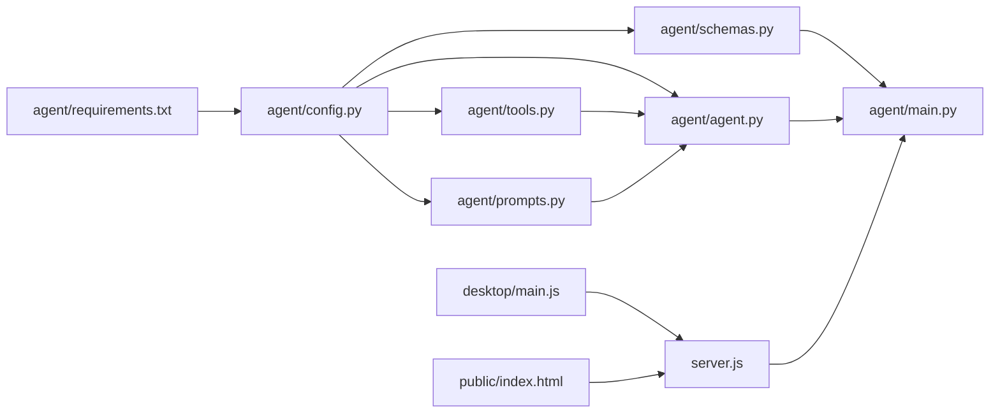

# Mineradio AI Agent 侧边栏 — 全栈集成计划

## 项目背景

Mineradio（路径：`e:/wyyapi/Mineradio`）是一款基于 Electron + Node.js 的 Windows 桌面沉浸式音乐播放器。后端 `server.js` 运行在 `:3000`，前端 `public/index.html` 为单页应用（原生 HTML/CSS/JS），暗色毛玻璃 UI 风格。

## 架构概览

```mermaid
flowchart TB
    subgraph Frontend[浏览器 / Electron]
        UI[public/index.html<br/>侧边栏 UI]
    end

    subgraph Node[Node.js 服务 :3000]
        Server[server.js]
        RouteChat[/api/agent/chat<br/>SSE 透传代理]
        RouteContext[/api/agent/context<br/>当前播放上下文]
    end

    subgraph Python[Python Sidecar :3001]
        FastAPI[FastAPI<br/>agent/main.py]
        Health[GET /health]
        Chat[POST /chat SSE 流]
        Agent[LangChain Agent]
        Tools[6 个 Tool 函数]
    end

    UI -->|POST /api/agent/chat| RouteChat
    UI -->|GET /api/agent/context| RouteContext
    RouteChat -->|HTTP 转发| Chat
    RouteContext -->|读取内存状态| Server
    Agent -->|httpx 调用| Tools
    Tools -->|GET| Server

    subgraph Electron[Electron 主进程]
        Main[desktop/main.js]
        Spawn[spawn Python 子进程]
        Kill[before-quit kill]
    end

    Main -->|创建窗口后| Spawn
    Main -->|退出时| Kill
    Spawn -->|启动| Python
```

## 交付物清单

| # | 文件 | 操作 | 说明 |
|---|------|------|------|
| 1 | `agent/requirements.txt` | 新建 | Python 依赖 |
| 2 | `agent/.env.example` | 新建 | 三组 LLM 配置模板 |
| 3 | `agent/config.py` | 新建 | Pydantic BaseSettings |
| 4 | `agent/schemas.py` | 新建 | 请求/响应模型 |
| 5 | `agent/prompts.py` | 新建 | System Prompt + Context 模板 |
| 6 | `agent/tools.py` | 新建 | 6 个 @tool 工具函数 |
| 7 | `agent/agent.py` | 新建 | LLM 构建、Agent Executor |
| 8 | `agent/main.py` | 新建 | FastAPI 应用入口 |
| 9 | `agent/memory.py` | 新建(可选) | 对话历史持久化 |
| 10 | `server.js` | 修改 | 新增两个路由 |
| 11 | `public/index.html` | 修改 | 侧边栏 UI + CSS + JS |
| 12 | `desktop/main.js` | 修改 | Python 进程管理 |

---

## 实施步骤

### Step 1: 创建 agent/ 目录（Python 侧）

项目根为 `e:/wyyapi/Mineradio/`，新建 `agent/` 目录。

#### 1a. `agent/requirements.txt`

```
fastapi==0.115.6
uvicorn[standard]==0.34.0
sse-starlette==2.2.1
langchain>=0.3.17
langchain-openai>=0.3.5
httpx>=0.28.1
python-dotenv>=1.0.1
pydantic-settings>=2.7.1
```

#### 1b. `agent/.env.example`

提供三组 LLM 配置模板，用户选择其一取消注释：

```ini
# === DeepSeek ===
LLM_PROVIDER=deepseek
DEEPSEEK_API_KEY=sk-your-deepseek-key
DEEPSEEK_API_BASE=https://api.deepseek.com
DEEPSEEK_MODEL=deepseek-chat

# === OpenAI ===
# LLM_PROVIDER=openai
# OPENAI_API_KEY=sk-your-openai-key
# OPENAI_API_BASE=https://api.openai.com/v1
# OPENAI_MODEL=gpt-4o-mini

# === Ollama ===
# LLM_PROVIDER=ollama
# OLLAMA_API_BASE=http://127.0.0.1:11434
# OLLAMA_MODEL=qwen2.5:7b

# 通用
NODE_SERVER_BASE=http://127.0.0.1:3000
AGENT_PORT=3001
```

#### 1c. `agent/config.py`

Pydantic `BaseSettings` 读取 `.env`：

- `LLM_PROVIDER`: str = "deepseek"
- `DEEPSEEK_API_KEY` / `DEEPSEEK_API_BASE` / `DEEPSEEK_MODEL`
- `OPENAI_API_KEY` / `OPENAI_API_BASE` / `OPENAI_MODEL`
- `OLLAMA_API_BASE` / `OLLAMA_MODEL`
- `NODE_SERVER_BASE`: str = "http://127.0.0.1:3000"
- `AGENT_PORT`: int = 3001
- `model_computed_config` 和 `model_post_init` 做校验

#### 1d. `agent/schemas.py`

```python
class ChatRequest(BaseModel):
    message: str
    context: dict = {}
    conversation_id: str = ""

class ChatResponse(BaseModel):
    type: str  # token | tool_start | tool_end | chain_end | error
    content: str

class HealthResponse(BaseModel):
    status: str = "ok"
    provider: str = ""
    model: str = ""
```

#### 1e. `agent/prompts.py`

**SYSTEM_PROMPT**（角色设定 + 推荐策略 + 回复格式）：

```
你叫 Mineradio AI，是专业的音乐推荐助手。

推荐策略优先级：
1. 基于当前播放的歌曲风格推荐相似歌曲
2. 基于用户歌单内容推荐
3. 根据时间/天气/场景推荐
4. 探索性推荐（发现新音乐）
5. 歌单介绍和解读

回复风格：
- 使用简洁的 Markdown，每段不超过 3 行
- 歌曲名用《》，歌手名用「」
- 适当使用 emoji
- 每条推荐必须附带推荐理由
- 超出音乐范围的问题，礼貌引导回音乐话题

当前上下文：
- 正在播放：{current_song}
- 队列中待播：{queue_count} 首
- 歌单数量：{playlist_count}
- 天气：{weather}
- 登录状态：{login_status}
```

**CONTEXT_TEMPLATE** 用于自动注入上下文。

#### 1f. `agent/tools.py`

6 个 `@tool` 装饰器定义的函数，通过 `httpx.AsyncClient` 调用 Node.js API：

1. **`get_user_playlists()`** → 调用 `GET /api/user/playlists` + `GET /api/qq/user/playlists`（需确认 QQ 路由是否存在），合并返回
2. **`get_playlist_tracks(playlist_id: str)`** → 调用 `GET /api/playlist/tracks?id={playlist_id}`
3. **`search_music(keyword: str)`** → 调用 `GET /api/search?keywords={keyword}`
4. **`get_artist_info(artist_id: str)`** → 调用 `GET /api/artist/detail?id={artist_id}`（注意现有路由是 `/api/artist/detail` 而非 `/api/artists`）
5. **`get_current_playback_context()`** → 调用 `GET /api/agent/context`
6. **`analyze_playlist_mood(playlist_id: str)`** → 基于歌曲名和歌手名做关键词情绪分类（开心/伤感/安静/激昂/浪漫）

`httpx.AsyncClient` 使用 `settings.NODE_SERVER_BASE` 作为 base_url。

#### 1g. `agent/agent.py`

- `build_llm(settings)` — 适配器模式，根据 `settings.llm_provider` 选择对应的 Chat Model
  - `deepseek` → `ChatOpenAI(model=..., openai_api_key=..., openai_api_base=..., streaming=True)`
  - `openai` → `ChatOpenAI(...)`
  - `ollama` → `ChatOllama(model=..., base_url=..., streaming=True)`
- `build_prompt(system_prompt)` — 使用 `ChatPromptTemplate.from_messages`
- `build_agent_executor(llm, tools, memory)` — 使用 `create_react_agent` + `AgentExecutor`
  - `max_iterations=8`
  - `handle_parsing_errors=True`
- `memory` 使用 `ConversationBufferMemory(return_messages=True, max_token_limit=4000)`
- `astream_events` 输出以下事件类型：
  - `on_chat_model_stream` → token
  - `on_tool_start` → tool_start
  - `on_tool_end` → tool_end
  - `on_chain_end` → chain_end

#### 1h. `agent/main.py`

FastAPI 应用入口：

- 启动时加载 `settings`、构建 `agent_executor`
- `GET /health` → 返回 `HealthResponse`
- `POST /chat` → 接收 `ChatRequest`，构建包含上下文注入的 prompt，通过 `astream_events` 流式返回 SSE
- 错误处理：LLM 调用失败返回友好错误

**SSE 事件格式**：

```
data: {"type": "token", "content": "推荐你"}
data: {"type": "token", "content": "一首《晴天》"}
data: {"type": "tool_start", "content": "get_user_playlists"}
data: {"type": "chain_end", "content": ""}
data: [DONE]
```

#### 1i. `agent/memory.py`（可选）

使用 `FileChatMessageHistory` 将对话历史持久化到 `conversations/` 目录，以 `conversation_id.json` 存储。

---

### Step 2: 修改 server.js（Node.js 侧）

#### 2a. `POST /api/agent/chat`

位置：在 `// ---------- 封面代理` 之前插入（约第 4134 行前）。

```javascript
// ---------- AI Agent 聊天转发 ----------
if (pn === '/api/agent/chat' && req.method === 'POST') {
  // 1. 读取请求 body
  // 2. 附加当前播放上下文：
  //    {
  //      currentSong: currentSong 对象,
  //      queue: playQueue.length 或队列摘要,
  //      playing: !!isPlaying,
  //      currentIdx: currentIdx,
  //      weather: currentWeather 或 null,
  //      loginStatus: userCookie ? 'logged_in' : 'not_logged_in'
  //    }
  // 3. 转发到 http://127.0.0.1:3001/chat
  // 4. SSE 透传回前端
  // 5. 连接失败时返回友好错误
}
```

关键实现细节：
- 使用 `fetch()` 以 POST 方式调用 Python 服务
- 设置 `res.writeHead(200, { 'Content-Type': 'text/event-stream', ... })`
- 用 `ReadableStream` 的 `getReader()` 逐块读取并 `res.write()` 到前端
- 在 `res.on('close')` 时中止 fetch

#### 2b. `GET /api/agent/context`

返回当前播放上下文：

```javascript
if (pn === '/api/agent/context') {
  sendJSON(res, {
    currentSong: currentSong || null,
    queue: playQueue ? playQueue.length : 0,
    playing: !!isPlaying,
    currentIdx: currentIdx !== undefined ? currentIdx : -1,
    weather: currentWeather || null,
    loginStatus: userCookie ? 'logged_in' : 'not_logged_in',
  });
}
```

---

### Step 3: 修改 desktop/main.js（Electron 侧）

#### 3a. 添加 `startPythonAgent()` 函数

```javascript
let pythonAgentProcess = null;

function startPythonAgent() {
  const agentPath = path.join(__dirname, '..', 'agent', 'main.py');
  if (!fs.existsSync(agentPath)) {
    console.log('[Agent] agent/main.py not found, skipping Python agent startup');
    return;
  }
  pythonAgentProcess = spawn('python', [agentPath], {
    cwd: path.join(__dirname, '..'),
    env: { ...process.env, PYTHONUNBUFFERED: '1' },
  });
  pythonAgentProcess.stdout.on('data', (data) => console.log('[Agent]', data.toString().trim()));
  pythonAgentProcess.stderr.on('data', (data) => console.log('[Agent]', data.toString().trim()));
  pythonAgentProcess.on('error', (err) => console.warn('[Agent] Failed to start:', err.message));
  pythonAgentProcess.on('exit', (code) => console.log('[Agent] Exited with code', code));
}
```

#### 3b. 在 `createWindow()` 中调用

在第 1344 行 `await waitForServer(localServer);` 之后添加：

```javascript
startPythonAgent();
```

#### 3c. 在 `before-quit` 中 kill

```javascript
app.on('before-quit', () => {
  unregisterMineradioGlobalHotkeys();
  closeOverlayWindows();
  if (localServer && localServer.close) localServer.close();
  if (pythonAgentProcess) {
    pythonAgentProcess.kill();
    pythonAgentProcess = null;
  }
});
```

---

### Step 4: 修改 public/index.html（前端侧）

涉及三个部分：CSS、HTML 结构、JavaScript 交互逻辑。

#### 4a. CSS 样式

新增 `#agent-panel`、`#agent-fab` 样式，与现有 `#playlist-panel` 风格一致：

```css
/* AI Agent 面板 - 右侧滑入 */
#agent-panel {
  position: fixed;
  z-index: 17;
  top: 78px;
  right: -380px; /* 初始隐藏 */
  width: 340px;
  max-height: calc(100vh - 120px);
  overflow: hidden;
  display: flex;
  flex-direction: column;
  background: rgba(12,12,18,0.42);
  border: 1px solid rgba(255,255,255,0.08);
  border-radius: 20px;
  padding: 16px;
  backdrop-filter: blur(40px) saturate(1.4);
  -webkit-backdrop-filter: blur(40px) saturate(1.4);
  box-shadow: 0 24px 80px rgba(0,0,0,0.45);
  opacity: 0;
  transition: right .55s cubic-bezier(.16,1,.3,1), opacity .45s cubic-bezier(.16,1,.3,1);
  pointer-events: none;
}
#agent-panel.show {
  right: 24px;
  opacity: 1;
  pointer-events: auto;
}
```

还需要以下子元素的样式：
- **头部**：`.agent-head` — AI 头像（渐变圆）+ 标题 + 状态文字 + 关闭按钮
- **消息区**：`.agent-messages` — 可滚动，flex:1
- **用户气泡**：`.agent-msg.user` — 右对齐
- **AI 气泡**：`.agent-msg.ai` — 左对齐
- **快捷建议按钮区**：`.agent-suggestions` — 3 个毛玻璃按钮
- **输入区**：`.agent-input-area` — textarea + 发送按钮
- **触发按钮**：`#agent-fab` — 右下角圆形毛玻璃，active 状态高亮
- **Tool 调用提示**：`.agent-tool-call` — 气泡显示正在分析

与现有项目 CSS 变量联动：
- 使用 `rgba(var(--fc-accent-rgb), ...)` 作为强调色
- 使用 `--glass-bg`、`--glass-border` 等已有变量

#### 4b. HTML 结构

在 `</body>` 前添加：

```html
<!-- AI Agent 侧边栏 -->
<div id="agent-panel">
  <div class="agent-head">
    <div class="agent-avatar"></div>
    <div class="agent-info">
      <div class="agent-title">Mineradio AI</div>
      <div class="agent-status">空闲中</div>
    </div>
    <button class="agent-close">✕</button>
  </div>
  <div class="agent-messages">
    <!-- 动态渲染 -->
  </div>
  <div class="agent-suggestions">
    <button data-suggest="recommend">🎵 推荐歌曲</button>
    <button data-suggest="intro">📋 介绍歌单</button>
    <button data-suggest="scene">🌤 场景推荐</button>
  </div>
  <div class="agent-input-area">
    <textarea placeholder="聊聊音乐..." rows="1"></textarea>
    <button class="agent-send">发送</button>
  </div>
</div>
<button id="agent-fab" title="AI 助手">🤖</button>
```

#### 4c. JavaScript 交互逻辑

主要功能模块：

1. **面板开关**：
   - `toggleAgentPanel()` — 切换 `#agent-panel` 的 `show` class
   - 打开时自动关闭其他 peek 面板（`fx-panel`、`playlist-panel`）
   - `#agent-fab` active 状态联动

2. **发送消息**：
   - `sendAgentMessage(text)` — 禁用按钮，显示"思考中..."
   - 构建请求体 `{ message: text, context: {}, conversation_id }`
   - 通过 `POST /api/agent/chat` 发起 SSE 请求（使用 `EventSource` 或 `fetch` + `ReadableStream`）
   - **推荐使用 `EventSource` 但限于 POST 请求限制，实际需用 `fetch` + 手动解析 SSE**

3. **SSE 流式接收**：
   ```javascript
   const response = await fetch('/api/agent/chat', {
     method: 'POST',
     headers: { 'Content-Type': 'application/json' },
     body: JSON.stringify({ message, context, conversation_id }),
   });
   const reader = response.body.getReader();
   const decoder = new TextDecoder();
   // 逐块读取，解析 SSE data: 行
   // type === 'token' → append token 到当前 AI 气泡
   // type === 'tool_start' → 显示 "🔍 正在分析你的歌单..."
   // type === 'chain_end' → 完成渲染
   ```

4. **Markdown 渲染**：
   - 简单的 Markdown 转 HTML：粗体 `**` → `<strong>`，斜体 `*` → `<em>`，行内代码 `` ` `` → `<code>`，换行 `\n` → `<br>`
   - 使用正则替换，不引入外部库

5. **自动滚动**：
   - 每次添加新内容后 `scrollTop = scrollHeight`

6. **快捷建议**：
   - 点击快捷按钮自动填充并发送预设消息

7. **输入处理**：
   - Enter 发送，Shift+Enter 换行
   - 发送后清空 textarea

8. **消息气泡渲染**：
   - 用户消息：右对齐，`.agent-msg.user`
   - AI 消息：左对齐，`.agent-msg.ai`，支持 Markdown 渲染
   - Tool 调用提示：`.agent-tool-call` 特殊样式

---

## 关键注意事项

### 现有 API 路由映射

| AI Tool 名称 | 调用的 Node.js 路由 | 确认状态 |
|---|---|---|
| `get_user_playlists` | `/api/user/playlists` | ✅ 存在（第 3837 行） |
| `get_playlist_tracks` | `/api/playlist/tracks?id=xxx` | ✅ 存在（第 4098 行） |
| `search_music` | `/api/search?keywords=xxx` | ✅ 存在（第 3416 行） |
| `get_artist_info` | `/api/artist/detail?id=xxx` | ✅ 存在（第 4050 行，注意路由是 `/api/artist/detail` 而非 `/api/artists`） |
| `get_current_playback_context` | `/api/agent/context` | 🆕 新增 |
| `analyze_playlist_mood` | 纯本地处理 | 不依赖 Node.js |

### QQ 音乐歌单

任务中提到调用 `/api/qq/user/playlists`，但当前 `server.js` 未找到此路由。需确认：
- 是否已存在 QQ 用户歌单路由？
- 若不存在，方案 A：在 `GET /api/agent/context` 中一并返回
- 方案 B：`get_user_playlists` tool 中仅调用已有 `/api/user/playlists` + 返回空 QQ 列表

**建议**：先使用已有的 `/api/user/playlists`（网易云），QQ 部分后续扩展。

### 前端 SSE 方案

由于 `EventSource` 不支持 POST 请求，需要使用 `fetch()` + `ReadableStream` 手动解析 SSE 数据流。前端需实现一个简单的 SSE 解析器，按 `\n\n` 分割事件块，提取 `data:` 行并 JSON 解析。

### Electron 打包注意事项

- `agent/` 目录需要包含在打包文件中（`package.json` 的 `files` 数组需添加 `"agent/**/*"`）
- Python 运行时需要用户自行安装，或在打包说明中注明依赖
- 生产环境可能需要打包为 PyInstaller 单文件

---

## 依赖关系图



## 实施顺序建议

1. 创建 `agent/` 目录和所有 Python 文件（无外部依赖，可并行编写）
2. 修改 `server.js` 添加两个新路由
3. 修改 `public/index.html` 添加前端 UI
4. 修改 `desktop/main.js` 添加 Python 进程管理
5. 端到端测试
